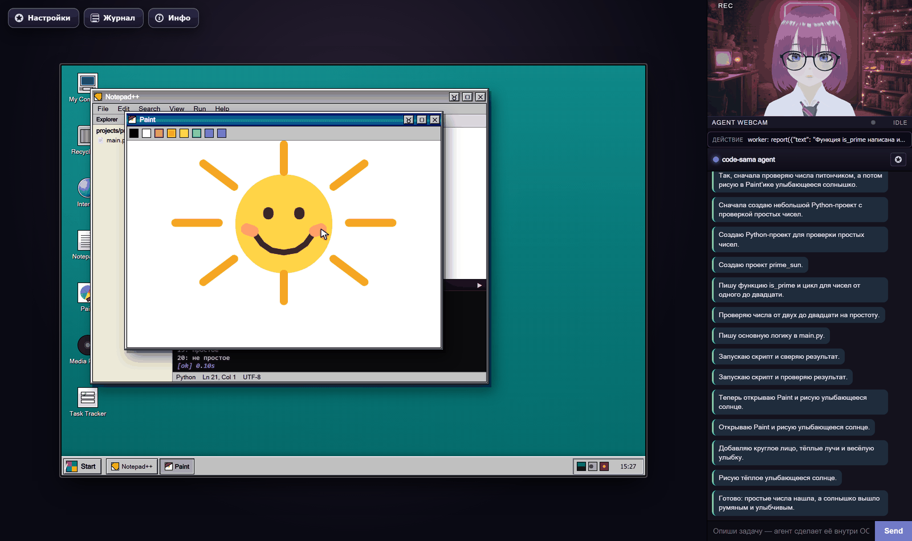
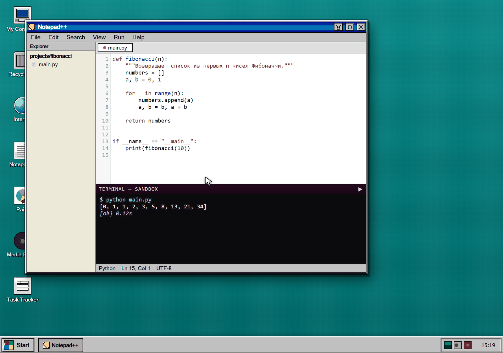
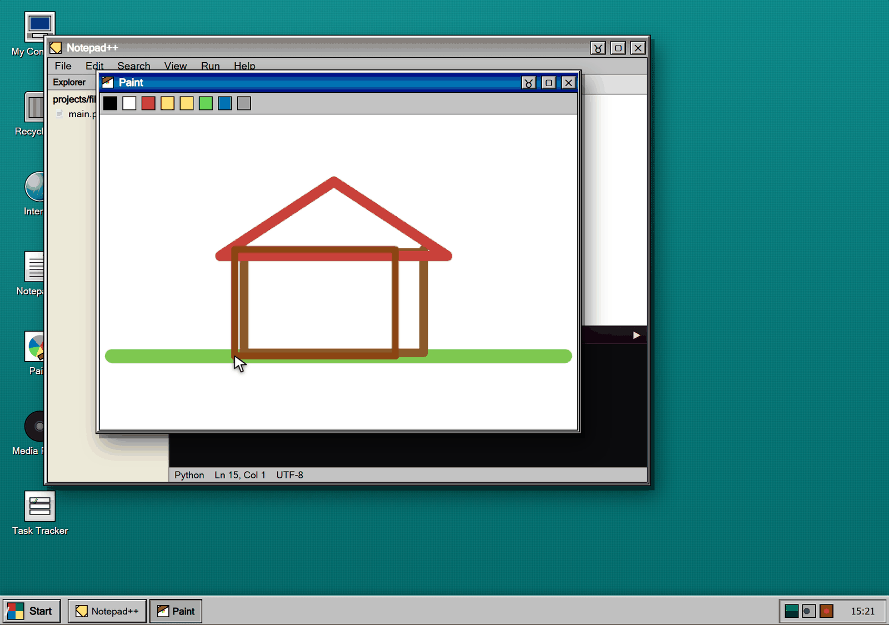
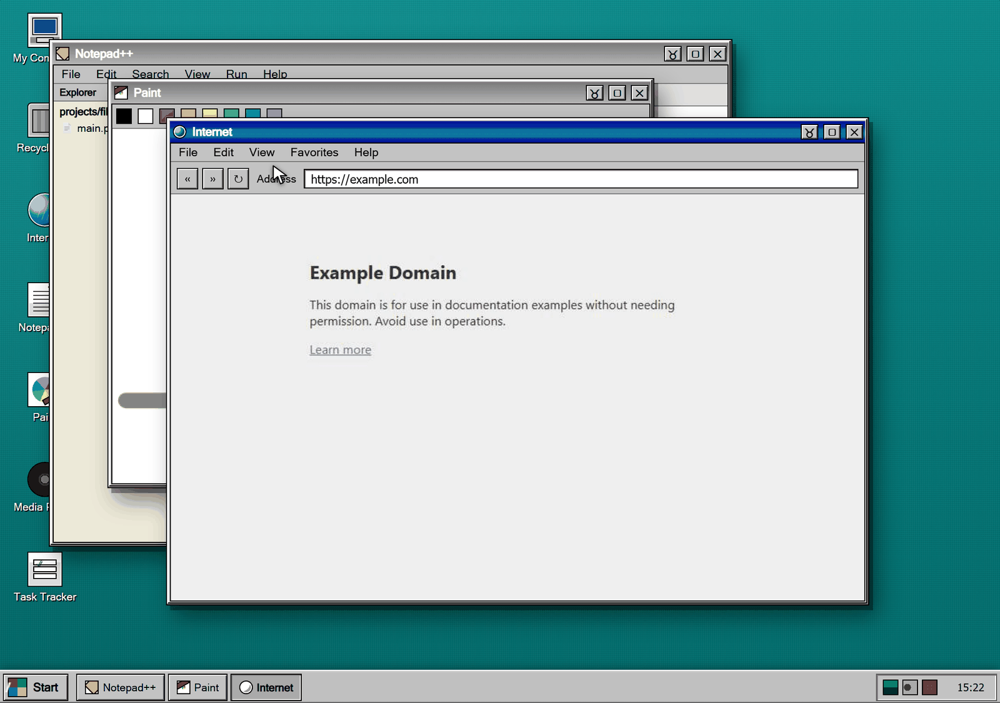
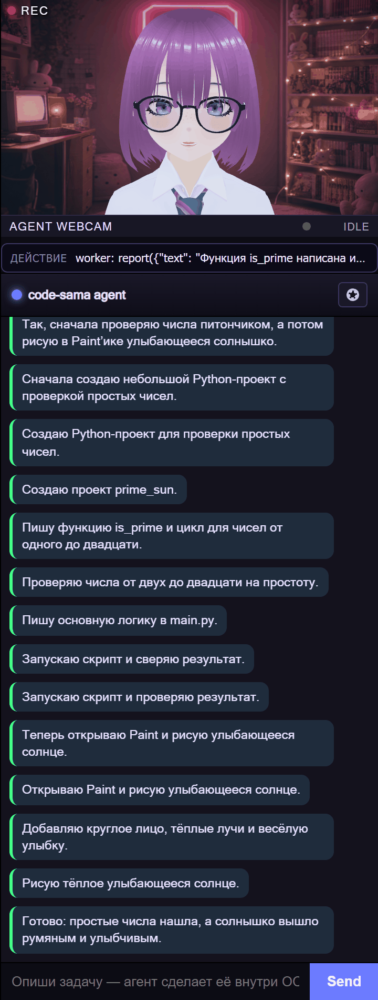
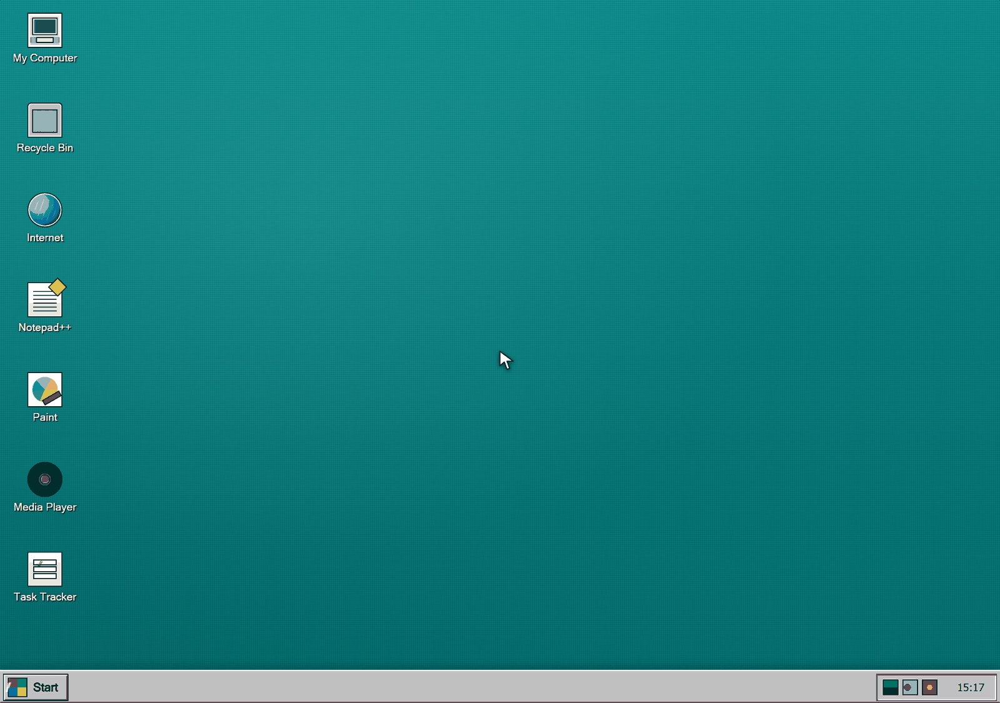

# code-sama-os

A Windows 95-styled web OS driven entirely by LangGraph agents. The user
cannot click anything — they only talk to code-sama in the side chat, and she
moves a virtual mouse, types character-by-character, opens and closes windows,
runs the code she writes, and narrates the whole thing out loud through a 3D
VRM avatar.



A small set of "real" apps is bundled:

- **Browser** — Playwright-backed Chromium streaming screenshots into the
  window.
- **Code Editor** — CodeMirror + file tree + a sandboxed terminal that
  actually runs what she writes.
- **Music Player** — local audio playlist.
- **Paint** — canvas the agent can draw on.
- **Task Tracker** — simple to-do list.
- **Linux apps** — any X11 program, streamed frame-by-frame into a Win95
  window (Docker mode only, see [App Loader](#app-loader--turn-any-linux-program-into-agent-tools)).

The right-hand side is the agent's chat plus an "agent webcam" showing her
VRM avatar with TTS-driven lip-sync.

## Screenshots

**She writes code and runs it.** The editor has a project tree, tabs, and a
terminal wired to a real Python sandbox — output lands back in front of the
viewer (and back in her own context, so she can debug herself):



**She draws.** Paint strokes are real cursor paths — the mouse travels along
every segment at human speed:



**She browses.** A headless Chromium renders the page server-side and streams
JPEG frames into the window chrome:



**She talks while her hands work.** The streamer agent narrates each step of
whatever the worker agent is doing, and every line is spoken by the avatar:

| Avatar | Live narration |
|---|---|
|  |  |

## Run

```powershell
./run.ps1
```

Then open <http://127.0.0.1:8765>. On first boot you get an empty desktop —
nothing happens until you give her something to do in the chat:



### Recommended: Docker (Linux isolation)

This is the intended mode. The agent server runs **inside a Linux container**
with Xvfb — real GUI apps and Python cannot open windows on your Windows
desktop.

```powershell
.\run-docker.ps1          # build + start
.\run-docker.ps1 -Logs    # follow logs
.\run-docker.ps1 -Down    # stop
```

Or just `.\run.ps1` — it auto-picks Docker when the engine is running.
Use `.\run.ps1 -Local` only for quick host-only debugging (no Linux broker).

The first Docker start builds the image (Xvfb, xdotool, ffmpeg, Playwright,
demo X11 apps). Drop API keys into `.env` (copied from `.env.example`).

### Local venv (no isolation)

```powershell
./run.ps1 -Local
```

Then open <http://127.0.0.1:8765>.
In this mode `Linux broker unavailable` is expected — sandbox GUI blocks
still apply, but there is no separate Linux desktop.

## Architecture

```
server/
  main.py             FastAPI app, WebSocket /ws, HTTP /chat
  state.py            Authoritative OS state + event bus
  bus.py              Async pub/sub connecting streamer <-> worker
  agents.py           Streamer + Worker LangGraph agents, Coordinator
  cursor.py           Bezier path generator + jittery typing intervals
  tools.py            Built-in agent tools that schedule OS events
  tool_registry.py    Dynamic tool surface (built-ins + loader apps + MCP)
  sandbox.py          Subprocess runner behind run_python / run_node
  browser_engine.py   Headless Chromium for the in-OS Browser app
  linux_broker.py     Xvfb-per-app compositor, streams X11 frames
  models.py           Role -> provider/model routing (models.yml)
  loader/             App Loader: manifest -> visible agent tools
web/
  index.html          Win95 shell + apps
  css/, js/, assets/
```

Every agent action goes through `state.py`, which emits broadcast events over
the WebSocket. The frontend is a passive renderer — `pointer-events: none`
everywhere except the chat box.

### Two agents, one persona

code-sama is presented to the viewer as a single person, but under the hood
there are two LangGraph agents on an async event bus:

| | Streamer (the voice) | Worker (the hands) |
|---|---|---|
| Role | talks, reacts, narrates | clicks, types, runs code |
| Tools | `start_coding`, `set_mood`, `stop_coding` | full OS surface + every loader app |
| Model | fast/chatty (`streamer` role) | strong coding model (`worker` role) |

They run as independent asyncio loops, so the avatar keeps speaking while the
worker is still typing line three of a script. The streamer's prompt forbids
ever referring to the worker as a separate entity — results come back framed
as *"what you yourself just did"*, so she always speaks in first person.

## App Loader — turn any Linux program into agent tools

`server/loader/` is code-sama's analog of CLI-Anything: instead of a CLI
REPL, it produces a **manifest** (YAML/JSON) that turns any Linux GUI or
CLI program into a set of *visible* agent tools. Two pilot manifests ship
in [`apps/`](./apps) (Firefox, GIMP).

The three pieces:

- **`Harness`** (`loader/harness.py`) — a 7-phase LLM pipeline that
  takes a plain-language description ("Audacity audio editor") and emits
  a manifest. The prompt lives in [`HARNESS.md`](./HARNESS.md).
- **`AppRegistry`** (`loader/registry.py`) — file-backed catalogue of
  installed manifests under `apps/` (and `apps/generated/` for LLM-made
  ones). Survives container rebuilds via the `workspace/` volume.
- **`Runtime`** (`loader/runtime.py`) — executes a manifest action as a
  visible choreography: cursor travels to the target (resolved via
  AT-SPI, with pixel-hint fallback), clicks, types — exactly like the
  built-in apps.

Element locators are resolved in priority order:
1. **AT-SPI** `role`+`name` (robust against resize/theme/locale).
2. **Pixel hint** `x_pct`/`y_pct` (for canvases without an a11y tree).
3. **Window centre** (final fallback so partial manifests still run).

The agent drives all this through six tools:
`app_list`, `app_describe`, `app_install`, `app_open`, `app_action`,
`app_close`. Same surface is mirrored over HTTP under `/loader/*`.

Example manifest fragment (Firefox):

```yaml
actions:
  navigate:
    params: { url: "str" }
    narration: "Иду в адресную строку, ввожу {url}…"
    steps:
      - click: url_bar
        dwell: 200
      - type: "{url}"
      - key: Enter
```

To generate a brand-new app at runtime:

```python
await harness.install("Inkscape vector editor", app_slug="inkscape")
```

…or just ask code-sama in chat: *"установи Inkscape и нарисуй там круг"*.

## Live narration

While the worker's "hands" are busy, the streamer keeps talking.
Every loader step (and any tool that emits progress events) feeds a
batched narration queue in `Coordinator`, which periodically asks the
streamer for one short spoken line — a sports-commentator track over the
on-screen action. Throttled by `NARRATION_MIN_INTERVAL_S`; disable with
`NARRATION_DISABLED=1`.

## Model routing — pick the right model for each job

`server/models.py` defines a `ModelRouter` that maps **roles** to
provider + model combinations, so you can put a strong coding model on
the worker, a small fast one on the narrator, a vision model on the
resolver, and so on. Roles used by the project:

| role       | what it does                                  |
|------------|-----------------------------------------------|
| `streamer` | chatty front-of-house, talks to the user      |
| `worker`   | the hands — coding, clicking, typing          |
| `narrator` | live commentary while the worker is busy      |
| `harness`  | generates new app manifests (CLI-Anything)    |
| `vision`   | screenshot-grounded element resolver          |
| `planner`  | reserved for a future high-level planner      |

Configuration lives in [`models.yml`](./models.example.yml) (copy to
`models.yml` and edit). `${VAR}` placeholders are interpolated from
your `.env`, so you never paste keys into the YAML. Without a
`models.yml`, the router falls back to the legacy `PROXY_API_KEY` /
`MODEL` / `STREAMER_MODEL` / `WORKER_MODEL` env vars — existing setups
keep working unchanged.

Inspect live configuration at `GET /models`; reload the file without a
restart at `POST /models/refresh`.

## Tool surface — every installed app is a first-class tool

`server/tool_registry.py` builds the agent's tool list dynamically:

- All built-in tools (`open_app`, `paint_stroke`, `run_python`, ...)
- One tool per action of every installed loader-app —
  `firefox_navigate(url)`, `gimp_apply_gaussian_blur(radius)`, ...
- Plus any external sources (MCP servers, plugins — see
  `server/mcp_hook.py`).

When an app is installed or uninstalled (via chat, HTTP, or the agent's
own `app_install` tool), the registry auto-rebuilds and the agent's
next invocation sees the new tools. Calling an app-action tool
**auto-opens** the app if it isn't running yet — "skills auto-connect":

> agent calls `gimp_apply_gaussian_blur(radius=5)` →
> GIMP launches in a visible window → cursor travels through
> Filters → Blur → Gaussian Blur → types `5` → clicks OK.

Inspect the current surface at `GET /tools`.

## MCP integration (opt-in)

`server/mcp_hook.py` is an extension point: register MCP servers and
their tools become first-class tools on the next registry rebuild. The
base image doesn't ship the `mcp` package — `pip install mcp` to enable.

## TypeScript MVP (legacy)

Ранний MVP из `Code-sama-architecture.md` остаётся в `src/`:

```bash
npm install
npm run check
```

- Точка входа рантайма: `src/runtime/orchestrator.ts`
- Scene/state/event bus: `src/core/*`
- Агенты: `src/agents/*`
- Проверки соответствия требованиям: `tests/architecture.spec.ts`
